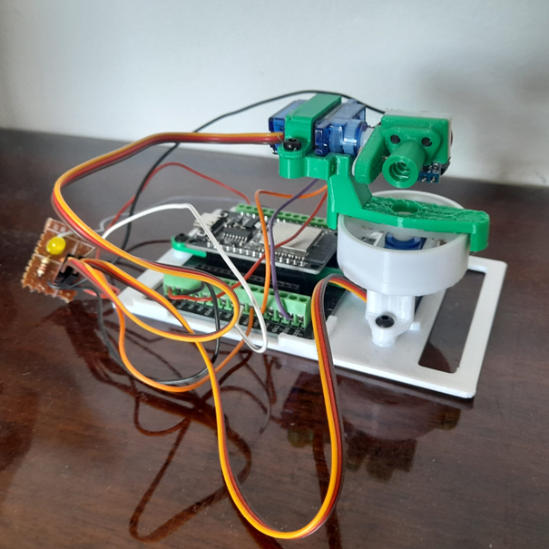
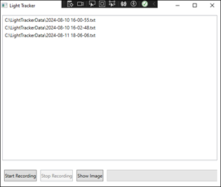
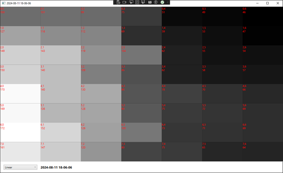

<h1 align="center">Light measurement using photoresistors on servo motors</h1>

# The content
1. [Introduction](#1-introduction)

2. [Functional requirements](#2-functional-requirements)

    2.1 [Cyclic light measurement](#21-cyclic-light-measurement)

    2.2 [Display of recorded files](#22-display-of-recorded-files)

    2.3 [Mapping functions](#23-mapping-functions)

3. [Technologies used](#3-technologies-used)

    3.1 [Windows Presentation Foundation (WPF)](#31-windows-presentation-foundation-wpf)

4. [Idea](#4-idea)

5. [Hardware](#5-hardware)

6. [Implementation](#6-implementation)

    6.1 [Arduino IDE](#61-arduino-ide)

    6.2 [Visual Studio 2019](#62-visual-studio-2019)

7. [Results](#7-results)

8. [Conclusion](#8-conclusion)

# 1. Introduction
In today's world, where technology is an unavoidable part of everyday life, the possibilities for system improvement and automation are almost unlimited.

The Arduino platform has emerged as a key tool for developing IoT projects, thanks to its simplicity, affordability and flexibility. As an open hardware and software platform, Arduino enables a wide range of applications, from simple school projects to complex industrial systems. With the help of Arduino, users can quickly and efficiently create prototypes of devices that communicate over the Internet, monitor various parameters and manage various processes.

The aim of this term paper is to explore and demonstrate how the ESP32 can be used to measure light using photoresistors and control servo motors.

This work will contribute to a better understanding of the automation of light measurement and control systems using simple but powerful IoT technologies, paving the way for further research and innovation in this area.

# 2. Functional requirements
In order to successfully realize the system, it is necessary to define the key functional requirements that will ensure the efficiency and reliability of the system.

These functional requirements lay the foundation for system design and implementation, ensuring that the system is capable of accurately measuring and displaying lighting data, providing users with the tools to analyze and make informed decisions.

The functional requirements of this project include the following components:

## 2.1. Cyclic light measurement
The system should be capable of automatically measuring the light intensity at regular intervals of 30 minutes.

A photoresistor, connected to the ESP32 board, records the light values ​​which are then stored in files.

These values ​​will be used to analyze the lighting in different time periods.

## 2.2. Display of recorded files
The system must allow users to select recorded files with lighting data and display them in a new window.

The user interface should be intuitive and easy to use, allowing users to easily search and review recorded data.

## 2.3. Mapping functions
The system should support various mapping functions that will allow visualization of lighting data as a 2D matrix of values.

This functionality is important for analyzing the spatial distribution of light and identifying patterns in the data.

Users should be able to choose the appropriate mapping functions that best suit their needs and the specifics of the data collected.

# 3. Technologies used
When implementing complex projects, it is extremely important to choose the appropriate technology that will enable efficient hardware management and provide a robust environment for software development. Choosing the right technology can significantly affect system performance, maintainability and scalability.

In the implementation of this project, the key technology that will be used for the development of the user interface is Windows Presentation Foundation (WPF). WPF is a powerful technology developed by Microsoft that enables the creation of modern and interactive applications for the Windows environment.

## 3.1. Windows Presentation Foundation (WPF)
WPF is a graphical subsystem for rendering user interfaces in Windows applications. WPF is part of the .NET Framework and enables the development of applications with advanced user interfaces, using XAML (eXtensible Application Markup Language) for declarative programming. One of the biggest advantages of WPF is the ability to declaratively bind ViewModel classes to the user interface, using DataBinding technology.

# 4. Idea
The idea of ​​this project is to create a light measurement system that uses an ESP32 microcontroller to control two servo motors, on which a photoresistor is attached.

The system works by having the ESP32 microcontroller control the movement of the servo motor, allowing the photoresistor to measure light intensity at different positions. Moving the servo motor allows the photoresistor to move in two axes: vertical and horizontal. The user enters minimum and maximum values ​​for vertical and horizontal positioning, which allows precise control of the photoresistor position.

The photoresistor is gradually moved from the initial position, increasing the horizontal value by 5 units until the maximum horizontal value. When it reaches the maximum horizontal value, the vertical value increases by 5 units, and the horizontal scrolling reverses to the minimum horizontal value. This cycle is repeated until the entire matrix of luminance values ​​is filled.

The result of this process is a matrix of values ​​that represents the intensity of light at different points in space. This matrix allows visualization and analysis of the spatial distribution of light, which is useful for analyzing lighting in different environments. The system enables precise measurement of light in different positions, automated data collection and adaptability to different needs and environments.

# 5. Hardware
The following hardware elements were used to implement the light measurement system:
- ESP32 Microcontroller: Used to control the system, control the servo motor and collect data from the photoresistor.
- Two servo motors: Enable precise positioning of the photoresistor in space. One motor controls horizontal movement, while the other controls vertical movement.
- Photoresistor: Measures light intensity. It is attached to servo motors and moves in two axes to provide illuminance readings at different points in space.

Together, these hardware elements enable the creation of a system that can precisely measure and visualize the spatial distribution of light.



# 6. Implementation
Two main development platforms were used to implement the system: Arduino IDE and Visual Studio 2019.

## 6.1. Arduino IDE
This platform was used to program the ESP32 microcontroller. In the Arduino IDE, the code that controls the servo motors and collects data from the photoresistor is written. This code allows the ESP32 microcontroller to control the movement of the servo motor, read the light and store the collected data.

``` C
void loop() {
  // put your main code here, to run repeatedly:
  if (readline(Serial.read(), serialbuf, 80) > 0) {
    //Serial.print("You entered: >");
    //Serial.print(serialbuf);
    //Serial.println("<");

    std::string s = serialbuf;
    int f = s.find(",");
    //Serial.printf("Delimiter at position: %d\n", f);
    if (f > -1) {
      // sada imamo dva podstringa razdvojena zarezom
      int len2 = s.size() - f + 1;
      std::string prvi = s.substr(0, f);
      std::string drugi = s.substr(f + 1, len2);
      //Serial.printf("prvi: %s\n", prvi.c_str());
      //Serial.printf("drugi: %s\n", drugi.c_str());

      // ako ima išta pre i posle zareza, pretvori to u brojeve
      if ((f > 0) && (len2 > 0)) {
        // primer parsiranja stringa u integer sa https://en.cppreference.com/w/cpp/string/basic_string/stol
        try {
          if (prvi == "READ") {
            int vangle, hangle;
            if (parseAngles(drugi, vangle, hangle)) {
              move(vangle, hangle);
              delay(100);
              int lux = readlight();
              Serial.printf("{%d, %d, %d}\n", vangle, hangle, lux);
            }
          } else if (prvi == "TABLE") {
            int vstart, vend, hstart, hend;
            if (parseTableArgs(drugi, vstart, vend, hstart, hend)) {
              scanTable(vstart, vend, hstart, hend);
              move(0, 0);
            }
          } else if (prvi == "TABLE2") {
            int vstart, vend, hstart, hend;
            if (parseTableArgs(drugi, vstart, vend, hstart, hend)) {
              scanTable2(vstart, vend, hstart, hend);
            }
          }

        } catch (std::invalid_argument const &ex) {
          Serial.println("!Invalid argument");
        } catch (std::out_of_range const &ex) {
          Serial.println("!Out of range");
        }
      }
    } else {
      int lux = readlight();
      Serial.printf("{%d}\n", lux);
    }
  }
  ledBlink();
}
```
The system works on the principle of a main loop that checks the entered commands. There are three commands: READ, which reads data from a single position, and TABLE and TABLE2, which read data in a given range. These last two commands work on the same principle, but return results in different formats.

## 6.2. Visual Studio 2019
This platform was used to develop a WPF application that controls the ESP32 microcontroller at a higher programming level. The WPF application allows users to manage the system, visualize collected data and control the device through an intuitive user interface.

The application consists of a main window (Figure 1) in which the user can start and stop data recording. While the recording is in progress, the progress bar shows the current number of collected data in relation to the maximum number. It is also possible to select recorded files and display them in a new window (Figure 2). In that new window, the user can select the mapping function, while the window itself displays a 2D matrix of light intensity readings. These values ​​are visually represented by different colors that correspond to the light intensity at certain positions.





```C#
 private void SerialPort_DataReceived(object sender, SerialDataReceivedEventArgs e)
 {
     try
     {
         string data = serialPort.ReadLine();

         // Find the start and end of the data block
         int startIndex = data.IndexOf('{');
         int endIndex = data.LastIndexOf('}') + 1;

         if (startIndex >= 0 && endIndex > startIndex)
         {
             // Extract only the part of the data within the braces
             string extractedData = data.Substring(startIndex, endIndex - startIndex);

             // Add the extracted data to the list
             lightDataList.Add(extractedData);
             Console.WriteLine($"Data received and extracted: {extractedData}");

             // Update ProgressBar
             Dispatcher.Invoke(() =>
             {
                 pbRecordingProgress.Value = lightDataList.Count;
             });
         }
         else
         {
             Console.WriteLine("No relevant data found in received message.");
         }
     }
     catch (Exception ex)
     {
         Console.WriteLine($"Error reading data: {ex.Message}");
     }
 }

private void SetupSerialPort()
{
    try
    {
        serialPort = new SerialPort("COM6", 115200);
        serialPort.DataReceived += SerialPort_DataReceived;
        serialPort.Open();
        Console.WriteLine("Serial port opened successfully.");
    }
    catch (Exception ex)
    {
        Console.WriteLine($"Failed to open serial port: {ex.Message}");
    }
}
```
# 7. Results
The results of this light measurement system allow simple and efficient analysis of the data collected by the photoresistor.

With a simple matrix search, it is possible to identify the points with the highest and lowest light intensity.

If the source of light is the Sun, this system allows tracking its movement over time. Changes in the position of maximum illumination can be used to track the sun's position.

# 8. Conclusion
This project demonstrates how modern microcontrollers, such as the ESP32, can be used to create a light measurement and analysis system. By using a servo motor to precisely position the photoresistor and collect data at different points in space, the system enables a detailed analysis of the spatial distribution of illumination.